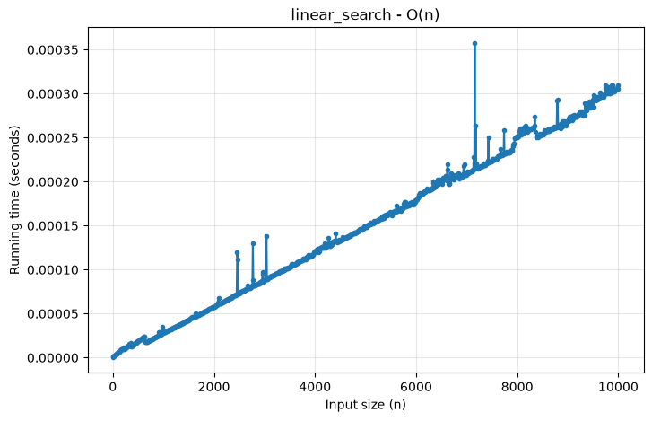
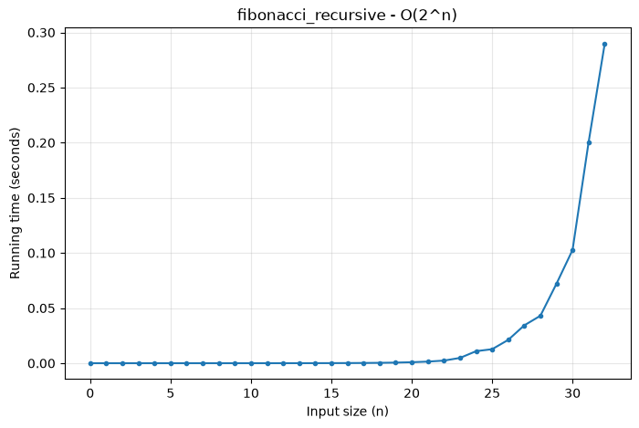
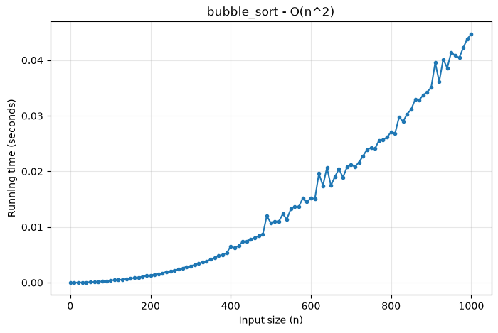

# Time Complexity Visualizer API

A small Flask server that **measures how long an algorithm takes as its input grows**, plots the result, and returns the graph as both a saved PNG and a base64 string in the JSON response.



*`linear_search` over n = 0 to 10,000 (step 10): running time grows in a straight line, which is O(n).*

## Quick start

Requires Python 3.11+ (the pinned matplotlib needs it).

**Windows (PowerShell)**
```powershell
python -m venv .venv
.\.venv\Scripts\Activate.ps1
pip install -r requirements.txt
python app.py
```

**macOS / Linux**
```bash
python3 -m venv .venv
source .venv/bin/activate
pip install -r requirements.txt
python app.py
```

The server listens on **http://localhost:8000**. Try it in a browser:

```
http://localhost:8000/analyze?algo=linear_search&step=10&n_max=10,000
```

From a terminal (quote the URL, or the shell treats `&` as an operator; on Windows use `curl.exe`, since plain `curl` is a PowerShell alias):

```bash
curl "http://localhost:8000/analyze?algo=linear_search&step=10&n_max=10,000"
```

## API

### `GET /analyze`

| Parameter | Required | Description |
|-----------|----------|-------------|
| `algo`    | yes | Algorithm name (see [table below](#supported-algorithms)). Surrounding quotes are ignored, so `algo='linear_search'` works. |
| `step`    | yes | Gap between input sizes, at least 1. |
| `n_max`   | yes | Largest input size to test. Commas are ignored, so `10,000` works. |

The minimum input size is always **0**, so the sizes measured are `0, step, 2*step, ... <= n_max`.

**Response (200)**

```json
{
  "algo": "linear_search",
  "complexity": "O(n)",
  "n_min": 0,
  "n_max": 10000,
  "step": 10,
  "truncated": false,
  "points": [{"n": 0, "seconds": 1.1e-07}, {"n": 10, "seconds": 9.0e-07}, "..."],
  "snapshot_path": "C:\\...\\snapshots\\linear_search_20260919_214517_358267.png",
  "image_format": "png",
  "image_base64": "iVBORw0KGgoAAAANSUhEUg..."
}
```

| Field | Meaning |
|-------|---------|
| `points` | One `{n, seconds}` entry per input size measured. |
| `snapshot_path` | Where the PNG was saved on the server (`snapshots/`). |
| `image_base64` | The same PNG, base64-encoded. Show it with ``. |
| `truncated` | `true` if the time budget ran out before reaching `n_max` (see [Limits](#limits-and-the-time-budget)). A `note` field explains where it stopped. |

**Errors (400)** return JSON with an `error` message, for an unknown `algo` (the reply also lists the supported ones), a missing or non-numeric parameter, `step < 1`, `n_max` above that algorithm's limit, or too many points.

### `GET /algorithms`

Returns every supported algorithm with its Big-O label and the largest `n_max` it accepts, e.g. `"fibonacci_recursive": {"complexity": "O(2^n)", "max_n": 35}`. `GET /` returns a short usage message.

## Supported algorithms

14 algorithms, covering every common complexity class. The first four are the required ones.

| `algo` | Complexity | Input used for the timing | Largest `n_max` |
|--------|-----------|---------------------------|----------------:|
| `linear_search`  | O(n)         | Sorted list, target absent (worst case) | 1,000,000 |
| `binary_search`  | O(log n)     | Sorted list, target absent (worst case) | 1,000,000 |
| `bubble_sort`    | O(n^2)       | List in reverse order (worst case) | 10,000 |
| `nested_loops`   | O(n^2)       | Two nested loops of n iterations | 10,000 |
| `selection_sort` | O(n^2)       | Random list (fixed seed) | 10,000 |
| `insertion_sort` | O(n^2)       | List in reverse order (worst case) | 10,000 |
| `merge_sort`     | O(n log n)   | Random list (fixed seed) | 1,000,000 |
| `quick_sort`     | O(n log n)   | Random list (fixed seed) | 1,000,000 |
| `heap_sort`      | O(n log n)   | Random list (fixed seed) | 1,000,000 |
| `constant_time`  | O(1)         | Random list; a single index lookup | 1,000,000 |
| `jump_search`    | O(sqrt n)    | Sorted list, target larger than every item (worst case) | 1,000,000 |
| `matrix_multiplication` | O(n^3) | Two random n x n matrices, triple loop | 250 |
| `fibonacci_recursive`   | O(2^n) | `fib(n)` by plain recursion | 35 |
| `permutations`          | O(n!)  | Visits every ordering of n items | 10 |

The last three grow so fast that `n` means something much smaller for them. Call them with a small `n_max` and `step=1`:

```
http://localhost:8000/analyze?algo=fibonacci_recursive&step=1&n_max=32
http://localhost:8000/analyze?algo=permutations&step=1&n_max=9
http://localhost:8000/analyze?algo=matrix_multiplication&step=10&n_max=200
```



*`fibonacci_recursive` over n = 0 to 32: flat, then a sharp climb, which is O(2^n). Each +1 in n roughly multiplies the time by 1.6.*

## How the measurement works

- **Setup is not timed.** Each algorithm has a `setup(n)` that builds its input and a `run(data)` that is timed. Building a list of n items is itself O(n), so timing it would make binary search look linear.
- **Worst-case inputs** are used where they matter (absent search targets, reversed lists for the quadratic sorts) so the curve matches the textbook Big-O.
- **Best of up to 5 runs** for very fast calls, because a single microsecond-scale timing is mostly noise. Slow calls (over 10 ms) are timed once.
- **`time.perf_counter()`** is used for timing, which is the high-resolution clock meant for benchmarks.
- **One benchmark at a time.** A lock serialises requests, because Flask's dev server is threaded and two concurrent benchmarks would compete for the CPU and corrupt each other's timings.
- **Plotting uses `matplotlib.figure.Figure`** directly rather than `pyplot`. That needs no GUI backend and is safe to call from a web server thread.

Timings are wall-clock and machine dependent, so expect small spikes from other processes (visible in the sample above). The shape of the curve is what matters, not the absolute numbers.

## Limits and the time budget

| Limit | Value |
|-------|-------|
| `n_max` | 0 up to the algorithm's own limit (see the [table above](#supported-algorithms)); above it the API returns a 400 |
| Points per request (`n_max / step + 1`) | at most 2,000 |
| Time budget per request | 30 seconds, across all points |

**Why each algorithm has its own `n_max` limit.** The time budget is checked *between* points, so it can't interrupt a single run that is already going. Without a limit, `bubble_sort` at n = 500,000 or `fibonacci_recursive` at n = 50 would run for hours and block every other request. The limits are set so that a single run of any algorithm takes about 5 seconds or less on a typical machine, and asking for more is rejected up front with a message:

```json
{"error": "'n_max' for fibonacci_recursive must be between 0 and 35 (a single run above that would take too long)"}
```

**Why the time budget still exists.** Even within the limits, the total of many slow points adds up. For example, `bubble_sort` with `step=10&n_max=10,000` stops at about n = 2,650. When the budget runs out the server **still returns a valid graph of what it measured**, with `"truncated": true` and a `note`. It is not an error. Use a smaller `n_max` or a larger `step` to cover the full range:

```
http://localhost:8000/analyze?algo=bubble_sort&step=10&n_max=1000
```



*`bubble_sort` over n = 0 to 1,000: the curve bends upward, which is O(n^2).*

## Project structure

```
app.py            Flask app: routes, input parsing, validation
algorithms.py     The 14 algorithms plus the ALGORITHMS registry (with per-algorithm n_max limits)
visualizer.py     Timing (measure) and graph/snapshot/base64 (render)
requirements.txt  Pinned dependencies
snapshots/        PNGs saved on each request (only the samples are committed)
```

### Adding an algorithm

1. Write a `setup(n)` and a `run(data)` function in `algorithms.py`.
2. Add one line to the `ALGORITHMS` dict: `"name": (setup, run, "O(...)", max_n)`. Choose `max_n` so a single run at that size takes a few seconds at most.

It is then available at `/analyze?algo=name` and listed at `/algorithms` with no other changes.

## Troubleshooting

**The URL returns a Django or other app's page.** Something else is already using port 8000. On Windows, a second process can bind a busy port without an error, so Flask starts but requests still reach the other program. Check what owns it:

```powershell
Get-NetTCPConnection -LocalPort 8000 -State Listen
```

Stop that program, or run this server elsewhere with the `PORT` variable:

```powershell
$env:PORT = "8001"; python app.py       # PowerShell
PORT=8001 python app.py                 # macOS / Linux
```

If you set `PORT` earlier in a terminal, clear it (`$env:PORT = $null`) to go back to 8000.

**`ERR_CONNECTION_REFUSED`.** The server isn't running on that port. Check the terminal running `app.py` for the port it printed.

**`Not Found` at `/`.** Older versions had no root route; use `/analyze` or update to the current `app.py`.
